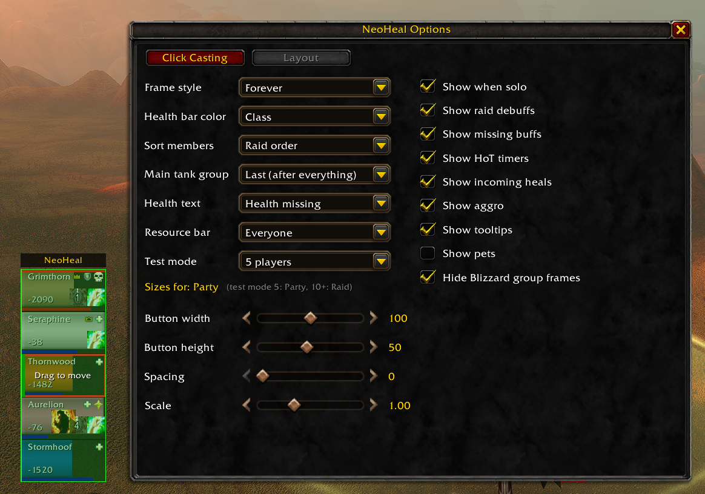
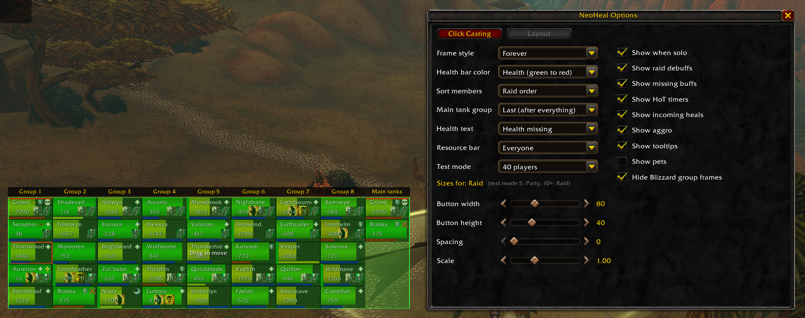

# Features

## Screenshots

Test mode with 5 players, with the Layout page of the options:

Test mode with 40 players: eight groups and the main tank group, health colors
from green to red, and the raid size preset:

## Opening the options

- `/neoheal` opens or closes the options window (Escape closes it too).
- Esc > Options > AddOns > NeoHeal has a button that opens the same window.
- `/neoheal debug` prints which HoT and raid marker data the game hides right
  now. Run it in combat to see what Forever hides.
- `/neoheal clicks` turns click debugging on or off: every click on a frame
  prints which mouse button arrived and what it is bound to.

While the options window is open the frames are in **move mode**: a green
overlay that you can drag. Outside move mode, **Ctrl + drag** a title ("NeoHeal"
bar, or a "Group N" label in a raid) to move the frames. Nothing moves in
combat.

## The frames

One column per raid group (1–8). Only groups with members take up room, so a
party shows one column and a full raid eight. The frames are pinned by their
top-left corner and grow to the right and down.

- **Solo or party:** one "NeoHeal" title bar above all frames.
- **Raid:** a label above every column ("Group 1", "Main tanks", "Pets").
- **Main tank group** (optional): raid members marked as Main Tank, before group
  1 or after everything. They also stay in their own group.
- **Pets** (optional): their own column(s) after the groups.

### What one frame shows

| Where | What |
| --- | --- |
| Health bar | Class colour (pets green), or green → yellow → red by health |
| After the health fill | Incoming heals (light green), then shields/absorbs (pale blue) |
| Empty part of health bar | Turns red below 35% health |
| Bottom strip | Resource bar (mana/rage/energy) for everyone, healers only, or nobody |
| Top left | Name, cut off at the icons (no "...") |
| Top right | Raid marker, role icon (main tank / main assist / tank / healer), leader crown or assist flag |
| Bottom left | Health text: percentage, health missing (`-2340`), or off. "Dead" / "Offline" |
| Bottom right | Up to 3 of **your own** HoTs with a cooldown swipe and optional countdown |
| Bottom right, 3rd slot | Out of combat: grey icon with red edge = this member lacks your class's raid buff |
| Centre, below the name | Up to 2 raid debuffs (e.g. boss debuffs), 1.5× the HoT icon size |
| Centre | Ready check answer, incoming resurrection, or incoming summon |
| Left edge | Dispel strip in the debuff type's colour, only for types **you** can remove (Magic blue, Curse purple, Disease brown, Poison green) |
| Top edge | Red line while the member has aggro |
| Border | White: your current target. Red: who your hostile target is targeting |
| Whole frame | Fades to 40% when out of range |

HoTs tracked per class: Priest Renew + Power Word: Shield, Druid Rejuvenation +
Regrowth. Other classes show no HoT icons.

Missing buffs per class: Priest Fortitude (+ Divine Spirit if talented), Druid
Mark of the Wild, Mage Arcane Intellect (not for warriors and rogues). Paladin
blessings are left out on purpose.

## Click casting (per character)

Pick a modifier (none, Shift, Ctrl, Alt), then choose per mouse button what a
click does. Five mouse buttons plus three **hover keys**: keyboard keys that
"click" the frame under the mouse (left click the key button to set, right click
to clear).

Actions:

- **None**
- **Target** and **Open unit menu**. On plain left and right click these are the
  game's own. Anywhere else (with a modifier, on middle click or buttons 4/5, or
  on a hover key) Blizzard's click bindings would drop them, so NeoHeal does them
  itself:
  - Target becomes a `/target` macro, so a spell waiting for a target isn't cast
    on the clicked unit.
  - NeoHeal opens the menu itself. An entry that needs Blizzard's secure code,
    such as Set Focus, may be blocked, and no menu opens while a spell waits for
    a target.
- **Cast missing buff**: casts the buff whose icon shows on that frame. In a raid
  it uses the group version if you know it and carry the reagent. Out of combat
  only, and not during a ready check. Otherwise the click does nothing and
  explains why in red at the top of the screen.
- **A spell** from your spellbook: "Highest rank" (follows new ranks you learn),
  "Highest rank -1" (the rank below that, also follows; useful as a cheaper,
  mana-efficient heal), or a fixed rank. The rank choices show only for spells
  with two or more ranks.

Per binding:

- **Cast on**: the clicked unit, its target, or its target's target.
- **Also target**: cast *and* target the unit in one click (spells only).

**Tooltip:** hovering a frame shows the unit tooltip with your bindings below
it: one line per bound button, such as "Left click — Flash Heal", including
middle click, buttons 4/5 and hover keys that have a key. Hold Shift, Ctrl or
Alt and the tooltip switches to that modifier's bindings, under its name. Holding
two modifiers at once shows none, because such a click does nothing, not even a
res or a missing buff. Bindings that don't go to the clicked unit name their
target, e.g. "Flash Heal (Unit's target)". The tooltip shows the bindings as
they work right now: a binding you change in combat appears once it takes
effect, when combat ends. One thing it doesn't show: on a dead friendly member a
spell click casts your res instead (see Auto-resurrect), while the tooltip still
lists the spells. The "Show tooltips" option switches the whole tooltip off.

After a learned spell the tooltip shows how much it heals or absorbs, for exactly
the rank the click casts:

- A heal shows its range in green, e.g. "Healing Wave 237-280". This includes
  Chain Heal (its first target) and Holy Shock (its healing).
- A heal over time shows its total, and Regrowth its direct heal.
- A shield shows its absorb in light blue, e.g. "Power Word: Shield 942 absorb".

The numbers come from the spell's own description, so it's not known yet whether
they include +healing from gear. In game on 2026-10-04 there was no +healing to
compare (`GetSpellBonusHealing()` returned 0). Only English descriptions are read.

Some spells show no number:

- Damage spells and cures.
- Tranquility and Lay on Hands, whose descriptions give no healing range.
- A spell whose data the game hasn't loaded yet: its description is empty until
  then. NeoHeal doesn't ask the game to load it; spells in your spellbook are
  normally loaded. Not checked in game.

**Auto-resurrect:** a spell click on a dead friendly member casts your res
spell instead (Priest Resurrection, Paladin Redemption, Shaman Ancestral Spirit,
Druid Rebirth). Target and menu clicks keep working.

**Reset to class defaults** restores the starting bindings: Ctrl+left = Target
and Ctrl+right = menu, plus the class's main heals and cures where learned.
Plain left and right click start as Target and menu too, unless a class heal
takes them: left click for Priest, Druid, Paladin and Shaman, right click for
Priest and Druid.

## Layout options (account-wide)

Left column:

| Option | Choices |
| --- | --- |
| Frame style | Forever (flat, dark) · Classic (stone, tooltip border) |
| Health bar color | Class · Health (green to red) |
| Sort members | Raid order · By name · Tanks, healers, damage · By class |
| Main tank group | None · First · Last |
| Health text | Percentage · Health missing · Off |
| Resource bar | Everyone · Healers only · Off |
| Test mode | Off · 5 · 10 · 25 · 40 fake players (lasts while the window is open) |
| Button width / height, spacing, scale | Saved **per size preset** |

**Size presets:** sizes, scale and position are kept separately for *Party*
(solo and party) and *Raid*. The sliders edit the preset in use. In test mode,
5 players edits Party and 10+ edits Raid.

Right column (checkboxes): show when solo, raid debuffs, missing buffs, HoT
timers, incoming heals, aggro, tooltips, pets, hide Blizzard group frames
(turning this off again needs a `/reload`).

Changes made in combat are applied when combat ends. The window shows a red
notice while that is the case.
